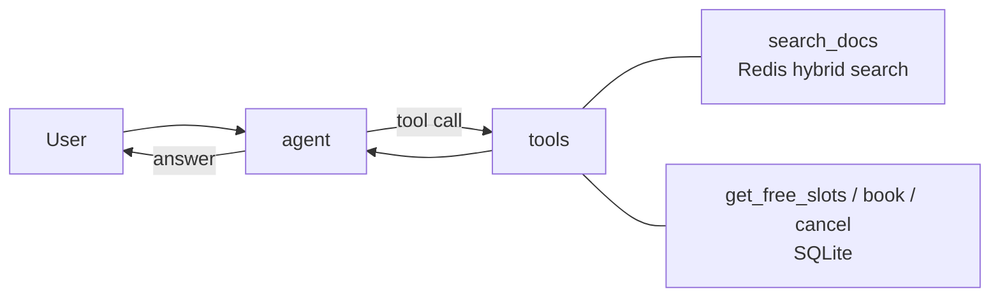

# دستیار سلامت روان برای کارمندان

یک چت بات محرمانه فارسی که به کارمندان یک شرکت غذایی در زمینه استرس خواب و فرسودگی شغلی کمک میکند به سوالات مربوط به خدمات مشاوره شرکت پاسخ میدهد و جلسات مشاوره رزرو میکند

ساخته شده با LangGraph و Redis Stack و Streamlit

## امکانات

- ایجنت LangGraph با قابلیت tool calling
- سیستم RAG با جستجوی ترکیبی شامل BM25 و vector روی Redis برای اسناد پوشه docs
- نمایش منابع استفاده شده برای هر پاسخ
- ابزار رزرو برای بررسی زمان های خالی رزرو و لغو جلسات مشاوره با دیتابیس SQLite
- پاسخ های استریم
- ذخیره حافظه مکالمات در Redis به عنوان LangGraph checkpointer که هر کاربر ترد اختصاصی خودش را دارد
## این سیستم چطور کار میکند

